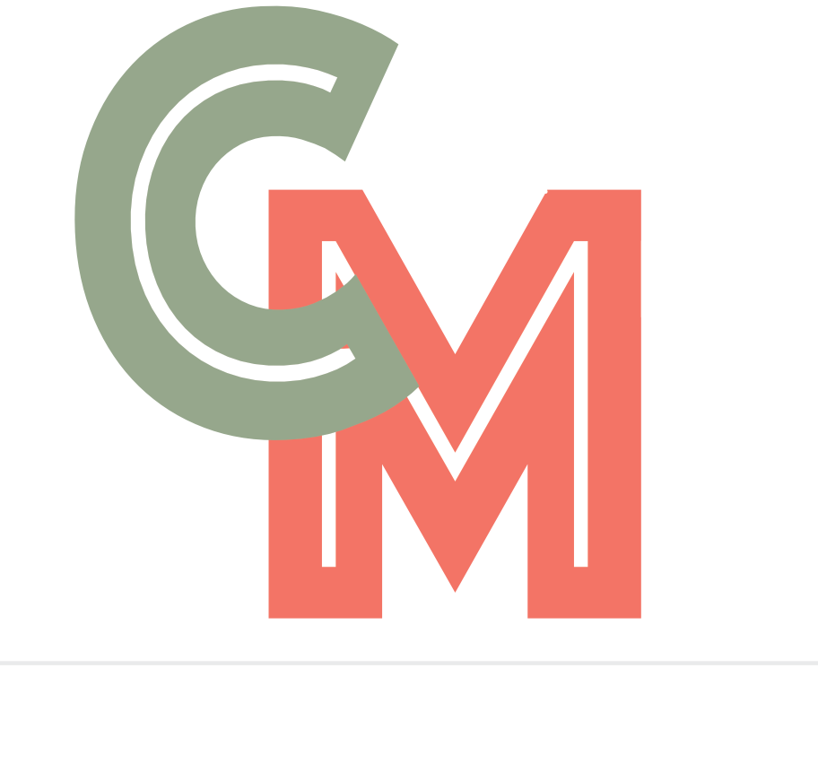

# CloudMaster Swift

CloudMaster Swift is a powerful iOS application designed to help you prepare for various cloud certification exams like AWS, Azure, GCP, Scrum, and more. This app is a testament to the capabilities of modern AI language models like ChatGPT and Claude.AI, as it was developed solely with their assistance, without any prior Swift experience.

## Personal Goal

My goal with this project was to create an mobile application from scratch in a for me unknown languange and unknown IDE. Relying solely on the guidance provided by large language models like ChatGPT and Claude.AI i was able to create this Swift application within Xcode. This endeavor aimed to showcase the potential of these AI models in assisting developers, even those without prior experience in a particular language or framework.

### Conclusion of this experiment

## 🌟 Features

- **Training Mode**: Practice and reinforce your knowledge with interactive training sessions.
- **Exam Mode**:
  - **Quick**: Simulate a quick exam experience for a targeted review.
  - **Intermediate**: Experience a moderately challenging exam simulation.
  - **Real Exam**: Immerse yourself in a realistic exam environment to test your preparedness.
- **Download AWS, GCP, and Azure Exam Data**: Access and download the latest exam data for AWS, GCP, and Azure certifications.

## 👥 Contributing

Contributions to this project are welcome! If you have any suggestions, bug fixes, or new features to propose, please submit a pull request or open an issue on the GitHub repository.

## Shoutout

A special shoutout goes to the [Ditectrev organization](https://github.com/orgs/Ditectrev/repositories?type=all) for providing the initial exam data used in this application. Their contribution was invaluable in kickstarting this project.

## 📜 License

This project is licensed under the Apache License - see the [LICENSE](LICENSE) file for details.
